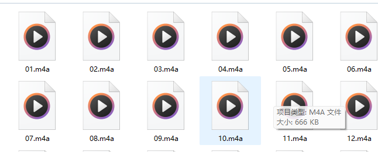
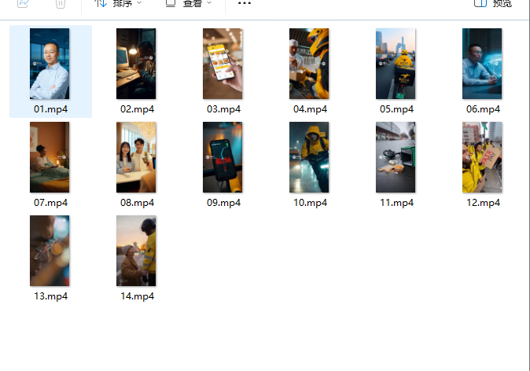

# 🎬 AutoDubProject - 一键生成英文配音作业

一键合成英文配音作业，高度兼容sora等ai视频生成模型，
输入：一堆视频（特别推荐ai生成），每个视频的配音。中文字幕，英文字幕。
输出：双语字幕英文配音视频。
## ✨ 主要功能

*   **⏱️ 自动变速对齐**：根据音频时长自动调整视频播放速度，确保画面与配音完美同步。
*   **🔗 智能拼接**：支持批量处理多个片段，并自动拼接为一个完整的长视频。再也不需要一次读完一整段英语，错了就需要重来。
*   **🤖 AI 双语字幕**：集成 `Stable-Whisper`，不同于自动识别音频，而是输入真正的字幕，ai去找字幕该在哪。防止发音不标准带来的尴尬。
*   **🎨 专业样式**：自动生成 ASS 字幕样式，支持字体、字号、颜色自定义。
*   **🚀 一键运行**：只需准备好素材，运行一个脚本即可完成全流程。

## 示例
一堆视频和对应的音频。视频由sora生成，具体提示词由ai生成，大概类似  


我希望能给我的英语课程生成一个介绍美团 王兴 的视频，长度两分钟。
视频的主题是介绍中国科技产业中具有影响力的人物，讨论其贡献及其工作带来的社会影响。
由于是视频，请你帮我编写一个剧本。
我希望介绍其贡献以及其工作所带来的社会影响，包括美团对骑手的严苛管理带来的争议
你的剧本我将会使用sora ai 生成视频画面，所以需要注意下面几点：
1 每次只能生成6-7秒，所以需要你切分成许多组提示词。一共两分钟 所以还需要不少组提示词
2 希望你尽可能详细的描述王兴的样貌 approximately 40 years old. He has a very short buzz cut (crew cut), high forehead, and wears delicate rimless glasses. He is wearing a light blue dress shirt, no tie. He looks calm, intellectual, and analytical.
3 希望每段视频都能有一定的场景变化，比如说描述一个骑手非常着急然后导致车祸。

可以参考的内容{
  1：早期创业失败,对着下降的数字痛哭，
  2: 顾客在手机上便捷的下单。
  3：厨师把外卖递给骑手，骑手骑电动车运输外卖。外卖员把外卖给顾客。
  4：不止于外卖，用户在生病了，骑手给用户送药物。 或者出行的时候用美团订酒店。
  5：骑手看着快截止的时间，飞快的跑，结果出了车祸。
  6：骑手们抗议，要求改善条件。


}



[▶️ 查看演示视频](doc/output.mp4)


## 📂 项目结构

在使用前，请确保目录结构如下：

```text
AutoDubProject/
│
├── inputs/                 # [输入] 存放所有素材
│   ├── video/              # 存放原始视频片段 (.mp4)
│   ├── audio/              # 存放配音音频 (.m4a) - 文件名需与视频一致
│   ├── text_en.txt         # 英文稿子 (用于 AI 强制对齐)
│   └── text_cn.txt         # 中文稿子 (用于双语展示)
│
├── outputs/                # [输出] 最终生成的视频将在这里
│
├── workspace/              # [临时] 存放处理过程中的中间文件
├── core/                   # [核心] 功能模块代码
├── config.py               # [配置] 参数设置 (字体、模型大小等)
├── main.py                 # [入口] 启动程序
└── requirements.txt        # [依赖] Python 库列表
```

## 🛠️ 环境准备

### 1. 安装 FFmpeg (必须)
本项目依赖系统级的音视频处理工具 **FFmpeg**。
*   **Windows**: 下载并解压 FFmpeg，将其 `bin` 目录添加到系统的 `Path` 环境变量中。
*   **Mac**: `brew install ffmpeg`
*   **验证**: 在终端输入 `ffmpeg -version`，能看到版本信息即为成功。

### 2. 安装 Python 依赖
在项目根目录下打开终端，运行：
```bash
pip install -r requirements.txt
```

> **注意**: 如果没有 N 卡显卡，Stable-Whisper 会自动使用 CPU 运行 PyTorch，无需额外配置。

## 🚀 快速开始

### 第一步：准备素材
1.  将分段的视频放入 `inputs/video/` (例如 `part1.mp4`, `part2.mp4`)。
2.  将对应的配音放入 `inputs/audio/` (例如 `part1.m4a`, `part2.m4a`)。
    *   ⚠️ **注意**：视频和音频的文件名（不含后缀）必须完全一致！
3.  将完整的英文稿子填入 `inputs/text_en.txt`。
4.  将完整的中文翻译填入 `inputs/text_cn.txt`。
    *   ⚠️ **注意**：中英文的行数最好对应，虽然程序有容错机制，但行数一致效果最好。

### 第二步：运行程序
在根目录下运行：

```bash
python main.py
```

### 第三步：获取结果
程序运行完毕后，打开 `outputs/` 文件夹，你将看到生成的 `final_submission.mp4`。

## ⚙️ 高级配置 (config.py)

你可以在 `config.py` 中修改以下参数以满足需求：

*   **WHISPER_MODEL**: AI 模型大小。默认为 `medium`。可选 `small`, `base`, `large` (显存要求更高，但精度更好)。
*   **FONT_NAME**: 字幕字体，默认为 `Arial`。
*   **FONT_SIZE**: 字幕大小，默认为 `8`。

## ❓ 常见问题

**Q: 报错 "FileNotFoundError: [WinError 2] 系统找不到指定的文件"**
A: 通常是因为没安装 FFmpeg 或者没有配置环境变量。请检查环境准备步骤。

**Q: 字幕对齐不准确？**
A: 请检查 `inputs/text_en.txt` 中的文本是否与音频实际读的内容一致。AI 使用强制对齐模式，文本必须准确。

**Q: 运行速度很慢？**
A: Whisper 模型在 CPU 上运行较慢。如果有 NVIDIA 显卡，请确保安装了 CUDA 版本的 PyTorch，速度会提升 10 倍以上。

